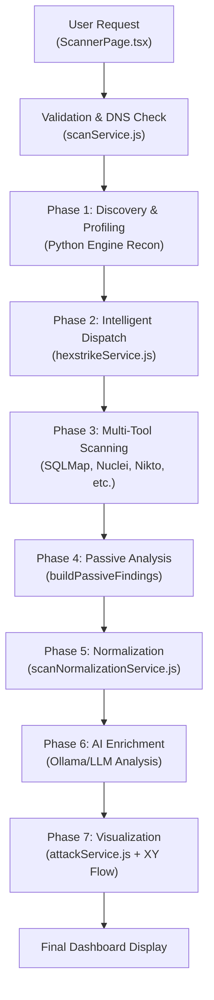

# HexStrike Scan Workflow Definition

This document defines the high-fidelity scan workflow for the CyberScope (HexStrike) security auditing system. It outlines the end-to-end process from target submission to final reporting.

> [!NOTE]
> This workflow represents the "Brain" of the application, ensuring that raw security data is transformed into actionable intelligence.

## 🔄 Workflow Overview

The system follows a 7-stage pipeline designed for accuracy, noise reduction, and actionable intelligence.

---

## 🛠️ Stage-by-Stage Breakdown

### 1. Ingress & Validation
- **Action**: Sanitize input URL and perform security checks.
- **Goal**: Prevent SSRF and ensure target reaches the scanner.
- **Key Logic**: 
    - Protocol normalization (ensure `http://` or `https://`).
    - **SSRF Protection**: Block private IP ranges (10.x, 192.168.x, etc.) and loopback addresses.
    - **DNS Resolution**: Verify target exists and resolves to a public IP.

### 2. Phase 1: Discovery & Profiling (Recon)
- **Action**: Fingerprint the target infrastructure using the Python engine.
- **Key Data Collected**:
    - **Tech Stack**: Detect CMS (WordPress), Frameworks (Django), and Server (Nginx).
    - **Attack Surface**: Identify open ports, IP addresses, and cloud providers.
    - **Confidence Score**: Reliability of the identification.

### 3. Phase 2: Intelligent Engine Dispatch
- **Action**: Dynamically select tools based on the target profile.
- **Logic**:
    - Avoid redundant scans (e.g., skip SQLMap on static files).
    - Prioritize context-sensitive tools (e.g., WPScan for WordPress).
    - Apply **Scan Profile** constraints (Quick, Balanced, Global).

### 4. Phase 3: Multi-Tool Scanning (DAST)
- **Action**: Parallel execution of 10+ vulnerability probes.
- **Vectors**: SQLi, XSS, Path Traversal, RCE, Broken Auth.
- **Output**: Aggregated data from SQLMap, Nuclei, Nikto, Ffuf, etc.

### 5. Phase 4: Passive Analysis
- **Action**: Non-intrusive metadata extraction.
- **Checks**:
    - **Security Headers**: CSP, HSTS, X-Content-Type-Options.
    - **Cookie Safety**: Secure/SameSite flags.
    - **Secret Scanning**: API Keys or private keys leaked in body content.
    - **Sensitive Files**: Probing for `/.env`, `/.git`, or `package.json`.

### 6. Phase 5: Normalization & Deduplication
- **Action**: Standardize findings and remove noise.
- **Heuristics**:
    - **Title Normalization**: Mapping tool-specific IDs to OWASP categories.
    - **Severity Promotion**: Escalating severity based on evidence markers (e.g., `uid=0`).
    - **Deduplication**: Grouping identical findings from different tools at the same endpoint.
    - **Noise Stripping**: Removing ASCII banners and progress logs.

### 7. Phase 6: AI Intelligence Enrichment (Ollama)
- **Action**: Use local LLMs for deeper reasoning.
- **Capabilities**:
    - **Impact Analysis**: Tailored explanation of risk.
    - **Remediation**: Custom code fixes for the detected issue.
    - **Evidence Verification**: Algorithmic reduction of False Positives.

### 8. Phase 7: Persistence & Visualization
- **Action**: Store results and generate the attack map.
- **Storage**: PostgreSQL via Prisma (`Scan`, `ScanResult`, `Vulnerability`).
- **Graphing**: Calculate dependency nodes for the **XY Flow** attack path visualization.

---

## 📊 Data Mapping Standards

| Field | Source | Extraction Logic |
| :--- | :--- | :--- |
| **Severity** | Tool + Logic | Initial tool rating → Promotion based on "High Impact Markers" |
| **Title** | Mapping Table | Tool ID mapped to human-readable `THREAT_TITLES` |
| **Evidence** | Raw Output | `stdout` + `stderr` capped at 4k chars |

---

## 🚀 Future Enhancements (Sprint 4-5)
- [ ] **Live Progress**: Socket.io integration for real-time tool logs in UI.
- [ ] **Vulnerability Comparison**: Diffing two scans on the same target.
- [ ] **Delta Scanning**: Scanning only the changed parts of an application.
